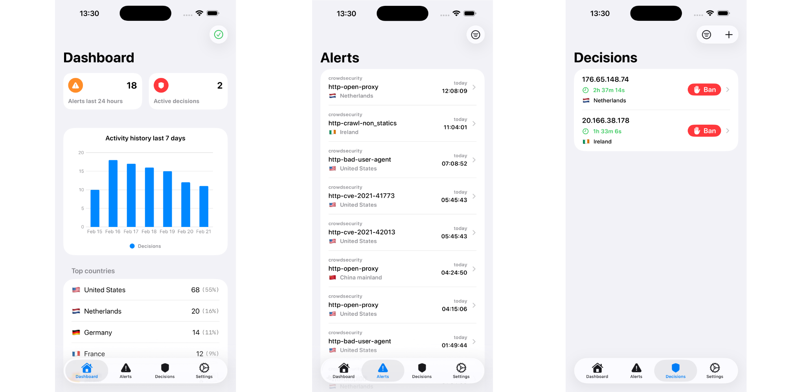

  

  <h1>CrowdSec Monitor</h1>
  

    CrowdSec Monitor is an application for iOS that allows you to check the statistics and values of your CrowdSec instance. It's built with SwiftUI for good performance, and follows the native design guidelines provided by Apple.
  

   
  

  
  

## Required API
CrowdSec Monitor gets it's data from an intermediate API between the app and CrowdSec's LAPI. This API caches the data and offers it with more filtering options. In order to use this app, you have to deploy this API next to your CrowdSec instance, on the same machine.

This API is available [here](https://github.com/JGeek00/crowdsec-monitor-api).

 
 
 
 

<b>Created by JGeek00</b>